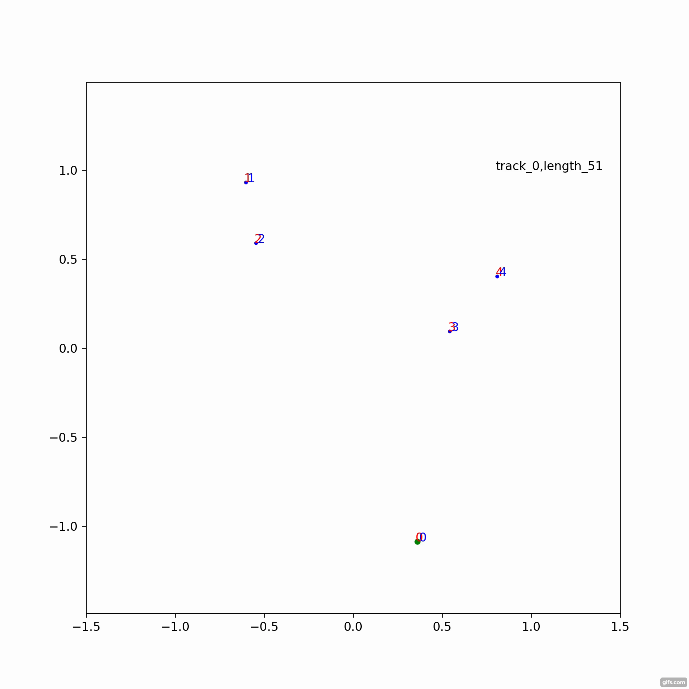
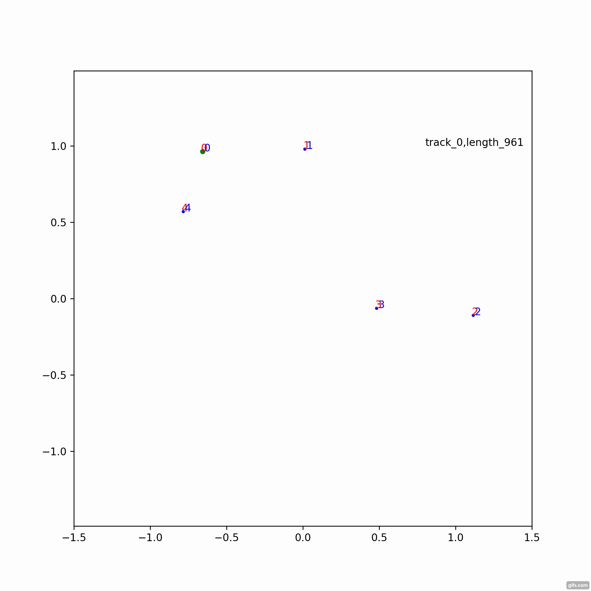
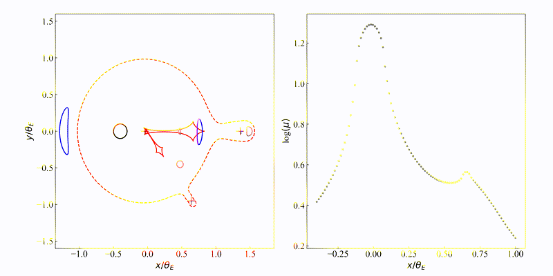
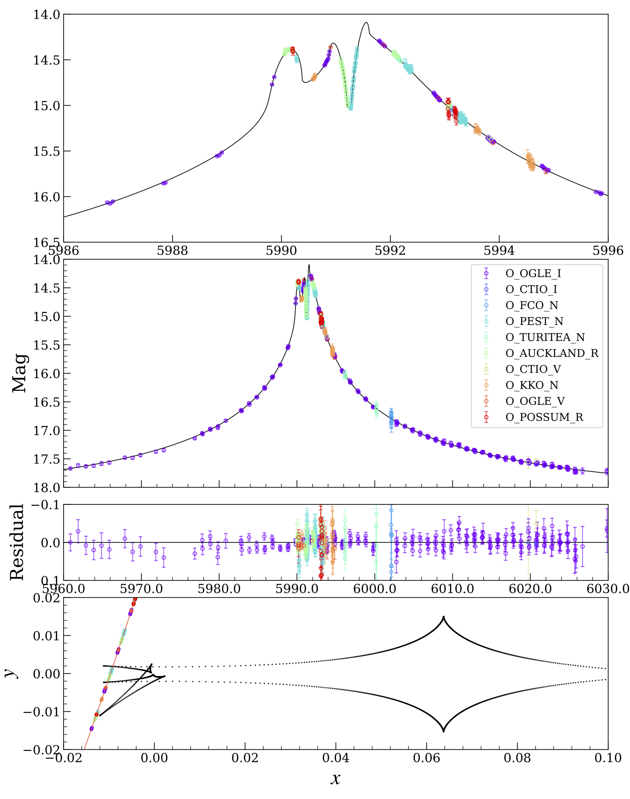

# Light Curve Calculations for Triple Microlensing Systems

The basic idea of this method is contour integration, with a new approach for connecting image solutions into continuous image tracks, which is presented in the paper: [Light Curve Calculations for Triple Microlensing Systems](https://doi.org/10.1093/mnras/stab509).

This software contains some basic data structures of the [VBBinaryLensing](https://github.com/valboz/VBBinaryLensing) software, and some optimizations (e.g., the Quadrupole test) which were presented in [V. Bozza et al., MNRAS 479 (2018) 5157](https://academic.oup.com/mnras/article-abstract/479/4/5157/5050380), see also their relevant papers [V. Bozza, MNRAS 408 (2010) 2188](https://academic.oup.com/mnras/article/408/4/2188/1420048), and [V. Bozza, E. Khalouei and E. Bachelet, arXiv:2011.04780](https://arxiv.org/abs/2011.04780).

The complex root solving algorithm is adopted from Jan Skowron & Andy Gould [code](http://www.astrouw.edu.pl/~jskowron/cmplx_roots_sg/) (see their [paper](https://arxiv.org/abs/1203.1034)) and translated to C++ by Tyler M. Heintz and Ava R. Hoag.

### cpp software

After compile with "make" command, the test example can be run as:

```shell
./bin/testtriple
```

Here we show how the closed image tracks are connected:

 


```


```

### python interface

In pymodule/python_bindings.cpp,  please change the path of pybind11.h and stl.h (by "locate pybind11.h" in terminal). Then simply run the following to build the python module "TripleLensing".:

```shell
sudo python3 setup.py install
(or python3 setup.py install --user)
```

Please check the **[example notebook](./notebooks/)** for the basic usage of this module.

Image topologies change as the source is moving (please see ./doc/top_lkv.mp4 for original movie):




### Applications

**This code is under more testing. We thank the feedbacks from the community and welcome more**. One way to test is rerun MCMC optimization (use this code to calculate magnifications) with the published solutions of triple events as initial guess. Here is an example result on [OGLE-2012-BLG-0026](https://ui.adsabs.harvard.edu/abs/2013ApJ...762L..28H/abstract):



### Small mass ratio

When the mass ratio is small (below ~ 1e-5), the solutions from the lens equation solver are more accurate when the origin of the coordinate system is set to be close to the smallest mass.