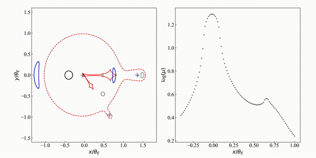

# Light Curve Calculations for Triple Microlensing Systems

This method is based on the image boundary connecting method, which is different from traditional inverse ray shooting routine. Also, the way of obtaining image bondaries is different from the previous  contour plot method of Schramm & Kayser (1987).

### cpp software

After compile with "make" command, the test example can be run as:

```shell
./bin/testtriple
```

Here we show how the closed image tracks are connected:

 


```


```

### python interface

Simply run:

```shell
sudo python3 setup.py install
```

to build the python module "TripleLensing"

then, the functionality of triple lens light curve calculation can be used as following:

```python
#test/testpymodule.py
import TripleLensing
TRIL = TripleLensing.TripleLensing()

#set up lens system
#fractional lens masses: m1, m2, m3
mlens = [0.968738798957637, 0.028093425169771, 0.003167775872591]
#lens positions: x1, y1, x2, y2, x3, y3
zlens = [-0.039343051506317, 0, 1.356656948493683, 0, 0.638936196010800, -0.950873946634155]

#source center
xsCenter = -0.034747426672208
ysCenter = -0.026627816352184
#source radius
rs = 0.005

#parameters controls the accuracy of finite source calculation
secnum = 45 # divide the source bondary into how many parts
basenum = 2 # the number density of sampled dots among each part
quaderr_Tol = 1e-5 # the Quadrupole test tolerance
relerr_Tol = 1e-3 # the relative error tolerance for magnification

#compute the magnification:
mu = TRIL.TriLightCurve(mlens, zlens, [xsCenter], [ysCenter], rs, secnum, basenum, quaderr_Tol, relerr_Tol)
print("finite source magnification: ", mu[0])
```

the output will be:

```shell
finite source magnification:  16.98219944608811
```

We also offer an interface to visualize the lens system configuration and critical curves and caustics:

```python
#simply call:
from utils import *
plot_critcaus_srcimgs(mlens, zlens, 0.7, 0, 0.1)
plt.show()
```

The resultant image is as follows:


We can also generate a light curve:

```python
from utils import *
# triple lens event parameters
t0 = 7494.153;
u0 = 0.021;
tE = 74.62;
s2 = 1.396;
q2 = 0.029;
alpha = 2.948; #//rad
s3 = 1.168;
q3 = 3.27e-3;
psi = 5.332; #//rad
rs = 0.22e-3
salpha = np.sin(alpha)
calpha = np.cos(alpha)
params = [t0, u0, tE, s2, q2, alpha, s3, q3, psi, rs]
# source position
ts = np.linspace(7470, 7510, 1000)
tn = (ts - t0) / tE;
y1s = u0 * salpha + tn * calpha;
y2s = u0 * calpha - tn * salpha;

# computing light curve
print("generating light curve ...")
mus = TRIL.TriLightCurve(mlens, zlens, y1s, y2s, rs, secnum, basenum, quaderr_Tol, relerr_Tol)
main, gs = pltlkv(ts, mus, params, label = "Without limb-darkening")
plt.show()
```

Here we show the resultant light curve:


The light curve with limb-darkening effect can also be calculated:

```python
Gamma = 0.51 # Gamma coefficient of the linear limb-darkening profile
u = gamma_to_u(Gamma)
# parameters controls the accuracy of limb-darkening calculation
RelTolLimb, AbsTolLimb = 1e-3, 1e-4

# source position
ts = np.linspace(7470, 7510, 100)
tn = (ts - t0) / tE;
y1s = u0 * salpha + tn * calpha;
y2s = u0 * calpha - tn * salpha;
rs = 0.1 # use a larger source radius to see the limb-darkening effect
params[9] = rs

print("generating light curve ...")
mus = TRIL.TriLightCurve(mlens, zlens, y1s, y2s, rs, secnum, basenum, quaderr_Tol, relerr_Tol)

print("generating light curve with limb-darkening ...")
musLimb = TRIL.TriLightCurveLimb(mlens, zlens, y1s, y2s, rs, secnum, basenum, quaderr_Tol, relerr_Tol, RelTolLimb, AbsTolLimb, u)
np.savez("../doc/demolkvs", ts=np.array(ts), muslimb=np.array(musLimb), musnolimb = np.array(mus))

main, gs = pltlkv(ts, mus, params, label = "Without limb-darkening")
main.plot(ts, np.log10( musLimb ), color="b",linewidth = 2, label = "With limb-darkening")
plt.legend()
plt.show()
```


Image topologies change as the source are moving (please see ./doc/top_lkv.mp4 for original movie):

